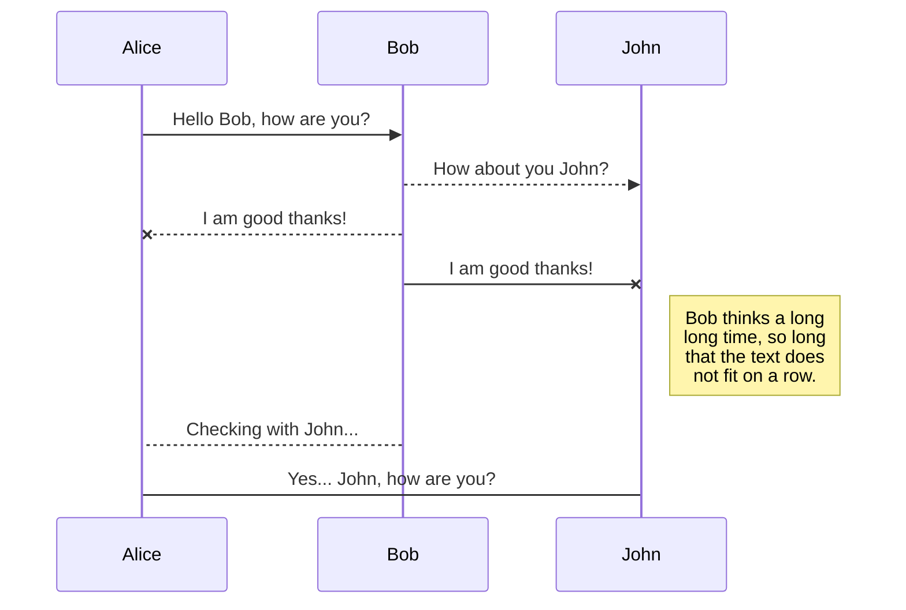

## Hello, world!
Dịch tròn nghĩa là **"Xin chào thế giới"**. Vẫn là câu đầu xuất ra màn hình chào sân bước vào nơi rắc rối của mỗi dev. Với mình đây là bài viết chào sân khi làm blog mới và ở blog này mình sẽ ghi lại tất cả những gì mình đã học được.

Cám ơn đã đến blog của mình. :purple_heart:

